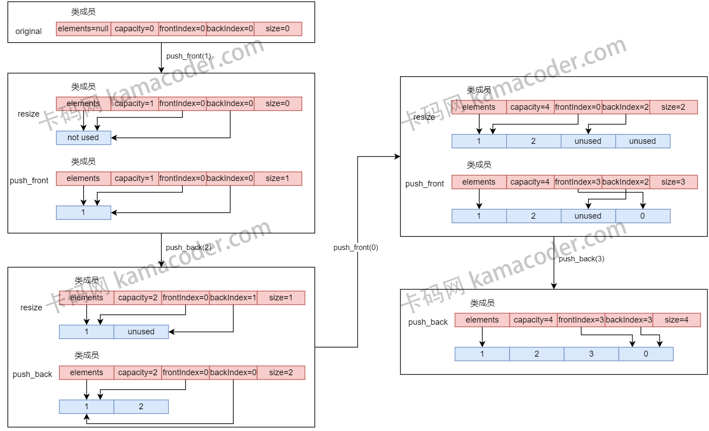

# deque

C++ STL中的`deque`（双端队列）是一种在内存中存储元素的数据结构，它支持在两端添加和删除元素。

## 特性

- 双端操作： `deque`支持在前端和后端执行快速的插入和删除操作。

- 随机访问： 与list不同，`deque`允许在常量时间内对元素进行随机访问。这是因为`deque`的内部结构采用分段数组，而不是链表，从而提供了更好的随机访问性能。

  - 在C++中，std::`deque` 允许在常量时间内对元素进行随机访问，这意味着可以通过索引直接访问`deque`中的元素，而不会随`deque`的大小而增加访问时间。下面是一个简单的例子来说明这一点：

    ```CPP
    #include <iostream>
    #include <deque>
    
    int main() {
        // 创建一个包含一些元素的deque
        std::deque<int> myDeque = {1, 2, 3, 4, 5};
    
        // 在常量时间内对元素进行随机访问
        std::cout << "Element at index 2: " << myDeque[2] << std::endl;
        std::cout << "Element at index 4: " << myDeque[4] << std::endl;
    
        return 0;
    }
    ```

    在上面的例子中，`myDeque[2]` 和 `myDeque[4]` 的访问时间是常量的，不受deque的大小的影响。

    这是因为`std::deque` 使用了分段数组的结构，每个分段都是一个固定大小的数组，因此可以直接计算索引的位置，而不需要遍历整个容器。

    请注意，虽然 `std::deque` 允许在常量时间内对元素进行随机访问。

    但与 `std::vector` 相比，`std::deque` 在访问元素时可能涉及更多的间接层次，因此在一些情况下，`std::vector` 的随机访问性能可能略优。

    在选择容器时，需要根据具体的使用情况和需求权衡不同容器的优劣。

- 动态扩展： `deque`的大小可以动态调整，无需事先分配固定大小的内存。这使得`deque`适用于需要动态增长和缩小的情况。

- 保持迭代器有效性： `deque`在进行插入和删除操作时，能够更好地保持迭代器的有效性。这意味着在进行这些操作后，不会导致所有迭代器失效。

- 内存局部性： `deque`的内部结构利用了多个缓冲区，有助于提高内存局部性，从而在某些情况下提供更好的性能。


# 工作原理

`C++ STL中`的 `deque`（双端队列）确实规定了接口和时间复杂度，但没有规定特定的实现细节。`C++` 标准描述了每个容器的行为和性能要求，具体实现留给了实现者。

**采用循环数组来模拟双端队列**

- 数据结构
  - `elements`: 动态数组存储队列元素
  - `capacity`: 数组容量
  - `size`: 数组长度(已使用的容量)
  - `frontIndex` 和 `backIndex` : 分别指向队列的前端和后端元素。注意， 此处的`frontIndex`和`backIndex`类似标准`STL`中的`begin`和`end`, `frontIndex`位置指向的数据是已存在的(除了`deque`为空的情况), 而`backIndex`指向的位置是当前末尾元素的下一个位置, 也就是还没有有效的数据(如果容量满了, 其会指向`frontIndex`的位置)
- **循环数组**：通过模运算来实现数组的循环效果，使得队列可以在数组的任意一端进行插入和删除操作, 因为索引越界后直接取模从另一端开始就可以了。
- **动态调整大小**：当数组达到容量限制时，会自动扩展容量（加倍扩展），并将所有现有元素复制到新的更大的数组中。
- **索引计算**：利用模运算来正确计算新的 `frontIndex` 和 `backIndex`，无论是添加或删除操作。

以下是一个图示说明， 展示了`deque`在两端插入的逻辑:



- 无论是`push_front`还是`push_back`, 都需要判断当前数组是否已满, 已满的话将其扩容为原容量的2倍, 将原来的数组元素复制到新的数组中。
- `push_front`需要将`frontIndex`自减后在`frontIndex`位置插入, `frontIndex`自减后需要加上`capacity`后对`capacity`取模, 这使得如果`frontIndex`为负, `frontIndex`将指向从数组末尾
- `push_back`直接在`backIndex`位置插入, 然后将`backIndex`自增, `backIndex`自增后需要对`capacity`取模, 这使得如果`backIndex`越界, `backIndex`将指向从数组开始的位置


# 和STL的区别

- 数据结构： 标准库中的 `std::deque`（双端队列）通常是通过一个或者多个连续存储区域（即一维数组）来实现的，而不是单一的连续数组, 这多个一维数组连接起来形成了`deque`数组, 目前的实现采用的是循环数组, 缺点就是`resize`时要复制旧数组, 而官方的`std::deque`只需要再串联一个一维数组就可以了, 效率更高, 本实现的优点在于:
  - 不需要`resize`的场景下性能好
  - 实现逻辑简单
- 内存管理： 在实际的 `STL` 中，内存管理通常会更加复杂和高效。`STL` 会使用分配器（`allocator`）来管理内存，而不是直接使用 `new` 和 `delete`。分配器允许用户提供自定义的内存管理策略。
- 性能优化： 实际的 `STL` 库通常会进行更多的性能优化，包括使用更复杂的数据结构、考虑缓存友好性等。此外，`STL` 中的容器和算法通常会根据使用情况进行自动选择，以提供最佳性能。


# 补充

#### 解释 `deque` 和 `vector` 的主要区别是什么？

- **内存分配**：`vector` 使用单一连续的内存空间来存储元素，而 `deque` 使用多个分散的内存块。这意味着 `deque` 可以在两端进行高效的插入和删除操作，而 `vector` 只能在尾部高效地进行这些操作。
- **插入效率**：在 `deque` 的前端和后端插入或删除元素的操作效率很高，但在中间插入或删除元素效率较低，因为它需要移动多个内存块中的元素。而 `vector` 在尾部插入和删除元素高效，但在前端或中间进行这些操作效率较低，因为可能需要移动大量元素。
- **随机访问**：`vector` 提供了更快的随机访问性能，因为它使用连续内存，而 `deque` 由于其分散的内存块，随机访问性能稍低。
- **内存耗费**：`vector` 在扩展时可能会有较大的内存重新分配成本，而 `deque` 因为是分块存储，所以通常不需要大量的内存重新分配。

#### 可以用 `deque` 实现一个固定大小的滑动窗口吗？如果可以，请演示如何实现。

**答案**: 是的，可以使用 `deque` 实现一个固定大小的滑动窗口。以下是一个简单的示例：

```cpp
#include <iostream>
#include <deque>

void slidingWindowMaximum(const std::vector<int>& nums, int k) {
    std::deque<int> window;
    
    for (size_t i = 0; i < nums.size(); ++i) {
        // 移除窗口左边界之外的元素
        if (!window.empty() && window.front() == i - k) {
            window.pop_front();
        }
        
        // 保持 `deque` 的递减顺序
        while (!window.empty() && nums[i] > nums[window.back()]) {
            window.pop_back();
        }
        
        // 添加当前元素的索引
        window.push_back(i);
        
        // 从窗口开始时输出最大值
        if (i >= k - 1) {
            std::cout << nums[window.front()] << " ";
        }
    }
    std::cout << std::endl;
}
```

这个函数接受一个整数数组 `nums` 和一个整数 `k` 作为窗口大小，然后打印出每次滑动窗口中的最大值


#### 在 `deque` 的前端插入一个元素时，迭代器会发生什么？

**答案**: 在 C++ STL 中，对于 `std::deque`，在前端插入元素通常会导致所有迭代器、引用和指针失效。这是因为 `deque` 可能会在内部进行重新分配，特别是当没有足够的前端空间来容纳新元素时。这与 `std::vector` 在尾部插入元素时迭代器保持有效的行为不同。

#### 在 `deque` 中使用 `[]` 操作符和 `at()` 方法有何区别？

**答案**:

- `operator[]` 提供对元素的无检查访问，这意味着如果使用超出范围的索引，它不会抛出异常，而是导致未定义行为。
- `at()` 方法提供边界检查的访问。如果指定的索引超出了 `deque` 的范围，`at()` 方法会抛出一个 `std::out_of_range` 异常。因此，`at()` 比 `operator[]` 更安全，但可能会略微降低性能。

使用 `at()` 方法可以帮助调试中发现越界错误，而 `operator[]` 在确定不会越界时可以提供更好的性能。


#### 解释 `deque` 的内部工作机制。它是如何实现两端插入和删除操作的高效性的？

**答案**: `std::deque` 维护了一系列定长数组（称为块或缓冲区），并且有一个中央控制器（通常是指针数组）来管理这些块。每个块可以独立地增长和收缩，这意味着当在两端添加或删除元素时，只有相关联的块受到影响。

- **在前端插入**：如果第一个块有空间，则在该块的开始插入新元素。如果没有空间，`deque` 会分配一个新块并将其链接到现有的块序列中。
- **在后端插入**：如果最后一个块有空间，则在该块的末尾插入新元素。如果没有空间，`deque` 会分配一个新块并将其链接到现有的块序列中。
- **在前端删除**：移除第一个块的第一个元素。如果该块变空，则释放该块资源并更新中央控制器。
- **在后端删除**：移除最后一个块的最后一个元素。如果该块变空，则释放该块资源并更新中央控制器。

通过这种方式，`deque` 可以在两端进行高效的插入和删除操作，而不需要移动除了操作点之外的其他元素，这在 `vector` 中是必须的。


#### `deque` 有多少种构造函数，它们分别是用来做什么的？

**答案**: `std::deque` 提供了多种构造函数，允许以不同的方式创建 `deque` 对象：

1. **默认构造函数**：创建一个空的 `deque`。

   ```cpp
   std::deque<int> dq;
   ```

2. **填充构造函数**：创建一个包含给定数量元素的 `deque`，每个元素都是拷贝自给定的初始值。

   ```cpp
   std::deque<int> dq(10, 5); // 10个元素，每个都是5
   ```

3. **范围构造函数**：使用两个迭代器作为参数，创建一个新的 `deque`，复制给定迭代器范围内的元素。

   ```cpp
   std::vector<int> vec{1, 2, 3, 4, 5};
   std::deque<int> dq(vec.begin(), vec.end());
   ```

4. **拷贝构造函数**：创建一个新的 `deque`，为另一个 `deque` 的拷贝。

   ```cpp
   std::deque<int> dq1(10, 5);
   std::deque<int> dq2(dq1); // 拷贝dq1
   ```

5. **移动构造函数**（C++11 引入）：从另一个 `deque` 移动元素，这通常涉及移动内部指针，而不是复制元素。

   ```cpp
   std::deque<int> dq1(10, 5);
   std::deque<int> dq2(std::move(dq1)); // 移动dq1
   ```

6. **初始化列表构造函数**（C++11 引入）：使用一个初始化列表来创建 `deque`。

   ```cpp
   std::deque<int> dq{1, 2, 3, 4, 5};
   ```

7. **带有分配器的默认构造函数**：创建一个空的 `deque`，但是使用自定义的分配器来分配内存。

   ```cpp
   std::allocator<int> alloc;
   std::deque<int, std::allocator<int>> dq(alloc);
   ```

8. **带有分配器的填充构造函数**：创建一个包含给定数量元素的 `deque`，每个元素都是拷贝自给定的初始值，并使用自定义的分配器来分配内存。

   ```cpp
   std::allocator<int> alloc;
   std::deque<int, std::allocator<int>> dq(10, 5, alloc); // 10个元素，每个都是5，使用自定义分配器
   ```

9. **带有分配器的范围构造函数**：使用两个迭代器作为参数，并使用自定义的分配器来分配内存，创建一个新的 `deque`，复制给定迭代器范围内的元素。

   ```cpp
   std::vector<int> vec{1, 2, 3, 4, 5};
   std::allocator<int> alloc;
   std::deque<int, std::allocator<int>> dq(vec.begin(), vec.end(), alloc);
   ```

10. **带有分配器的拷贝构造函数**：创建一个新的 `deque`，为另一个 `deque` 的拷贝，并使用自定义的分配器来分配内存。

    ```cpp
    std::deque<int> dq1(10, 5);
    std::allocator<int> alloc;
    std::deque<int, std::allocator<int>> dq2(dq1, alloc); // 拷贝dq1，使用自定义分配器
    ```

11. **带有分配器的移动构造函数**（C++11 引入）：从另一个 `deque` 移动元素，并使用自定义的分配器来分配内存。这通常涉及移动内部指针，而不是复制元素。

    ```cpp
    std::deque<int> dq1(10, 5);
    std::allocator<int> alloc;
    std::deque<int, std::allocator<int>> dq2(std::move(dq1), alloc); // 移动dq1，使用自定义分配器
    ```

12. **带有分配器的初始化列表构造函数**（C++11 引入）：使用一个初始化列表来创建 `deque`，并使用自定义的分配器来分配内存。

    ```cpp
    std::allocator<int> alloc;
    std::deque<int, std::allocator<int>> dq({1, 
    ```