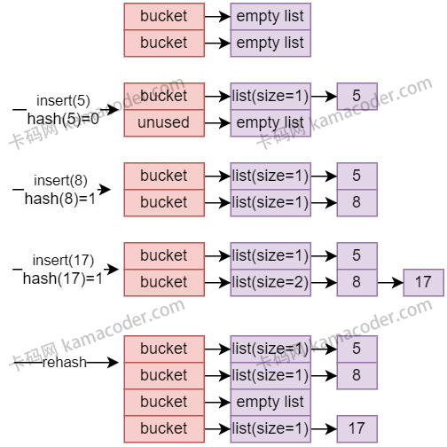

# HashTable

## 原理

1. **基础**
   - 哈希表是一种通过哈希函数将键映射到索引的数据结构。
   - 哈希函数负责将任意大小的输入映射到固定大小的输出，即哈希值。这个哈希值用作在数组中存储键值对的索引。
2. **冲突解决**
   - 可以使用链地址法解决冲突，即在哈希表的每个槽中维护一个链表，将哈希值相同的元素存储在同一个槽中的链表中。
3. **扩容与再哈希**
   - 为了避免哈希表中链表过长导致性能下降，会在需要时进行扩容。
   - 扩容过程涉及到重新计算所有元素的哈希值，并将它们分布到新的更大的哈希表中。这一过程称为`rehashing`。
4. **性能优化**
   - 使用二次哈希函数、空间配置器、内存池等，以减小内存分配的开销，提高访问速度。
5. **并发与多线程安全**
   - 多线程哈希表的实现通常会考虑并发性和多线程安全性，通过锁或其他机制来保护共享的数据结构。

