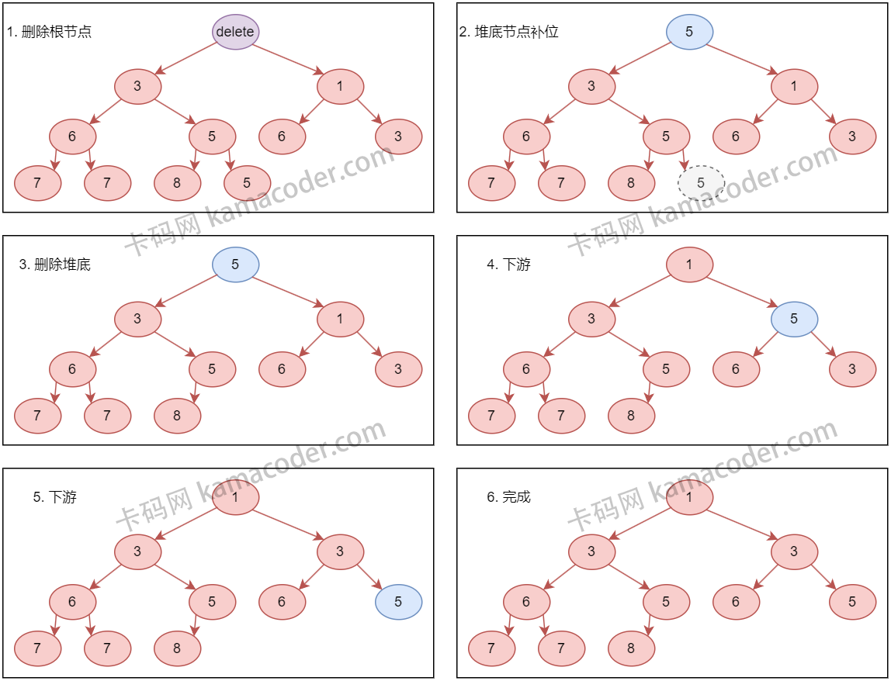

# priority_queue

`priority_queue` 的底层是堆。

C++标准库中 直接使用 std::make_heap, std::push_heap, std::pop_heap 来实现

# 堆

堆（Heap）是一种特殊的完全二叉树，它满足下面的性质：

1. **结构性质：** 堆是一个完全二叉树，这意味着除了最后一层外，每一层都是完全填满的，而最后一层的节点则尽可能地集中在左边。
2. **堆性质：** 在一个最大堆（Max Heap）中，每个节点的值都大于或等于其子节点的值，根节点的值是堆中的最大值。相反，在一个最小堆（Min Heap）中，每个节点的值都小于或等于其子节点的值，根节点的值是堆中的最小值。

## 插入和删除

- **插入操作（Insertion）：** 插入新元素时，新元素首先被放置在树的最后一个位置，以保持完全二叉树的结构。然后，该元素会通过一个称为“上浮”（或“堆化”）的过程，与其父节点比较并交换位置（如果在最大堆中新元素比父节点大，或在最小堆中新元素比父节点小）。这个过程重复进行，直到新元素到达一个位置，它不再比父节点大（或小，取决于是最大堆还是最小堆），或者它已经到达了树的顶部。
  - 
- **删除操作（Deletion）：** 在堆中，删除操作通常指的是删除根节点，即最大元素或最小元素。删除后，堆的结构性质必须得到维护。这通常通过将最后一个元素移到根节点的位置来完成，接着执行“下沉”（或“堆化”）过程，该元素会与其子节点比较并根据需要与较大（或较小）的子节点交换位置。这个过程持续进行，直到该元素位于正确的位置，或者它已经到达了树的底部。
  - 
- **构建堆（Heapify）：** 从无序数组构建堆的过程称为堆化（Heapify）。这可以通过从最后一个非叶子节点开始，对每个节点执行下沉操作来完成。在数组中，给定索引为`i`的元素，其左子节点的索引为`2*i + 1`，右子节点的索引为`2*i + 2`，父节点的索引为`(i-1)/2`。
  - 

# 补充

1. **如何从给定的无序数组中找到第 K 大的元素？**

   *可以利用最小堆来解决这个问题。步骤如下：*

   - 创建一个大小为 K 的最小堆。
   - 遍历数组，将数组的前 K 个元素添加到堆中。
   - 对于剩下的元素，如果元素大于堆顶元素，就替换堆顶元素，并重新堆化。
   - 最终，堆顶元素即第 K 大的元素。

   *时间复杂度：`O(n log k)`*

2. **什么是堆排序？它的时间复杂度和空间复杂度是多少？**

   *堆排序是一种利用堆结构的排序方法。*

   - 将无序数组构建成一个最大堆。
   - 重复从堆中删除最大元素，并将其放到数组的尾部。

   *时间复杂度：`O(n log n)`* *空间复杂度：`O(1)`（就地排序）*

3. **二叉堆和斐波那契堆有什么区别？它们的操作的时间复杂度有何不同？**

   *二叉堆和斐波那契堆是不同类型的堆，主要区别在于他们的操作时间复杂度。*

   - **二叉堆：**插入和删除操作的时间复杂度为 `O(log n)`。

   - **斐波那契堆：**插入操作和减小关键字的时间复杂度为 `O(1)`，删除最小元素的时间复杂度为 `O(log n)`，但是均摊时间复杂度。

     - 斐波那契堆（Fibonacci Heap）是一种特殊的堆数据结构，它在某些操作上表现出非常优异的时间复杂度，特别是对于需要频繁执行合并（merge）和减少键值（decrease key）操作的应用场景，如Dijkstra算法和Prim算法。

       ### 斐波那契堆的关键特点：

       1. **松散的结构：**
          - 斐波那契堆允许树的结构更加“松散”，不强制保持严格的堆序性。与二叉堆或二项堆不同，斐波那契堆中的树不是严格平衡的，这使得操作可以推迟整理，从而在摊销复杂度上获得优势。
       2. **多个根节点：**
          - 斐波那契堆由一组最小堆有序的树组成。最小堆有序意味着对于每棵树的每个节点，其父节点的键值都小于等于其子节点的键值。堆中的最小元素始终位于这些树的根节点集合中。
       3. **摊销复杂度：**
          - 斐波那契堆最显著的优势在于其摊销复杂度。在进行一系列操作时，每个操作的平均成本较低。摊销分析基于势能方法，考虑的是操作序列中每个操作的平均成本，而不是单个操作的最坏情况。

4. **如何在 O(n) 时间复杂度内构建一个堆？**

   *构建堆的步骤如下：*

   - 从最后一个非叶子节点开始，向下进行堆化操作。
   - 重复上述步骤，直到处理到根节点。

   *时间复杂度：`O(n)`*

