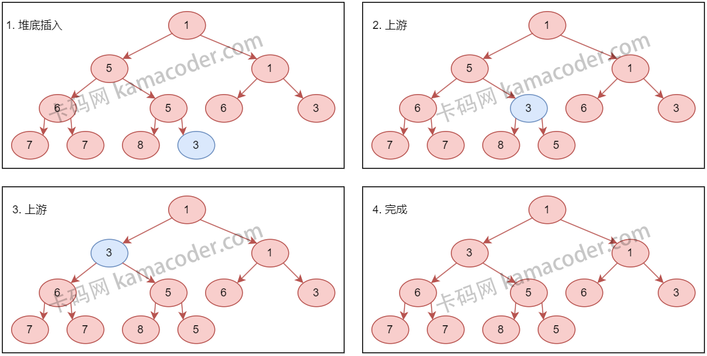
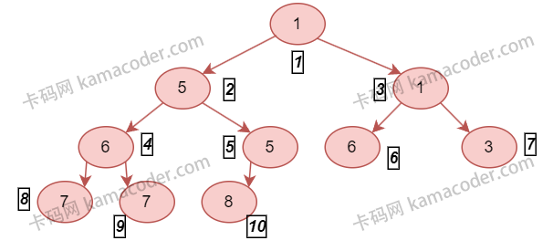

# priority_queue

`priority_queue` 的底层是堆。

C++标准库中 直接使用 std::make_heap, std::push_heap, std::pop_heap 来实现

# 堆

堆（Heap）是一种特殊的完全二叉树，它满足下面的性质：

1. **结构性质：** 堆是一个完全二叉树，这意味着除了最后一层外，每一层都是完全填满的，而最后一层的节点则尽可能地集中在左边。
2. **堆性质：** 在一个最大堆（Max Heap）中，每个节点的值都大于或等于其子节点的值，根节点的值是堆中的最大值。相反，在一个最小堆（Min Heap）中，每个节点的值都小于或等于其子节点的值，根节点的值是堆中的最小值。

## 插入和删除

- **插入操作（Insertion）：** 插入新元素时，新元素首先被放置在树的最后一个位置，以保持完全二叉树的结构。然后，该元素会通过一个称为“上浮”（或“堆化”）的过程，与其父节点比较并交换位置（如果在最大堆中新元素比父节点大，或在最小堆中新元素比父节点小）。这个过程重复进行，直到新元素到达一个位置，它不再比父节点大（或小，取决于是最大堆还是最小堆），或者它已经到达了树的顶部。
  - 
- **删除操作（Deletion）：** 在堆中，删除操作通常指的是删除根节点，即最大元素或最小元素。删除后，堆的结构性质必须得到维护。这通常通过将最后一个元素移到根节点的位置来完成，接着执行“下沉”（或“堆化”）过程，该元素会与其子节点比较并根据需要与较大（或较小）的子节点交换位置。这个过程持续进行，直到该元素位于正确的位置，或者它已经到达了树的底部。
  - 
- **构建堆（Heapify）：** 从无序数组构建堆的过程称为堆化（Heapify）。这可以通过从最后一个非叶子节点开始，对每个节点执行下沉操作来完成。在数组中，给定索引为`i`的元素，其左子节点的索引为`2*i + 1`，右子节点的索引为`2*i + 2`，父节点的索引为`(i-1)/2`。
  - 