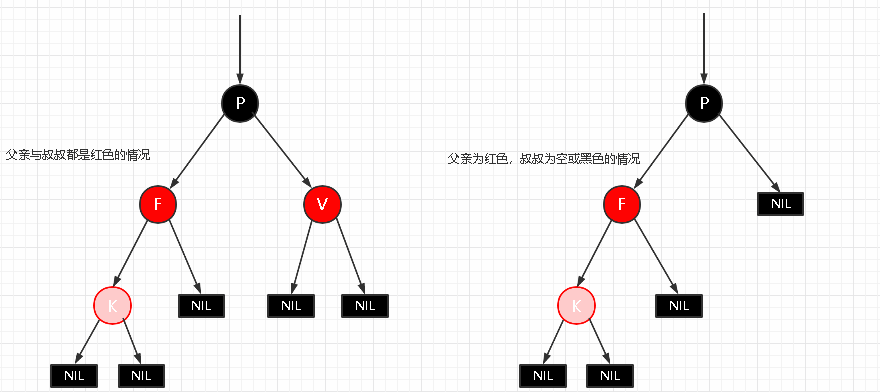
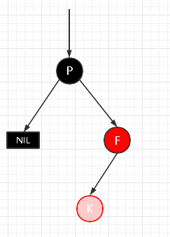

# AVL平衡二叉树

平衡二叉树也叫AVL（发明者名字简写），也属于二叉搜索树的一种，与其不同的是AVL通过机制保证其自身的平衡。

> AVL树是最先发明的自平衡二叉查找树。
>
> 在AVL树中任何节点的两个子树的高度最大差别为1，所以它也被称为高度平衡树。
>
> 增加和删除可能需要通过一次或多次树旋转来重新平衡这个树。

## 特性

AVL树本质上还是一棵二叉搜索树，它有以下特性：

- 特性1： 对于任何一颗子树的root根结点而言，它的左子树任何节点的key一定比root小，而右子树任何节点的key 一定比root大；
- 特性2：对于AVL树而言，其中任何子树仍然是AVL树；
- 特性3：每个节点的左右子节点的高度之差的绝对值最多为1；

> 特性1表明，AVL 继承于 BST , 所以:
>
> 1.AVL本身首先是一棵BST 二叉搜索树。
> 2.AVL带有平衡条件：每个结点的左右子树的高度之差的绝对值（平衡因子）最多为1。

在插入、删除树节点的时候，如果破坏了以上的原则，**AVL树会自动进行调整**使得以上三条原则仍然成立。

也就是说，AVL树，本质上是**带了平衡功能的二叉查找树**（二叉排序树，二叉搜索树）。

## 平衡过程

**旋转之前，首先确定旋转支点（pivot）：** 这个旋转支点就是失去平衡这部分树，在自平衡之后的根节点，平衡的调整过程，需要根据pivot它来进行旋转。

只关注**失衡子树的根结点** 及它的子节点和孙子节点即可。

左旋就是逆时针转，右旋是顺时针转

## 失衡的四大场景

### LL型失衡-左左结构失衡（右旋）：

场景： 插入的元素在子树root的左侧不平衡元素的左侧

此时，以root的左儿为支点，也就是，左侧的不平衡元素为pivot(支点), 进行右旋

- 右旋过程中，如果pivot有右子树，则作为 原root的 左子树， 保障AVL的特性1

### RR型失衡：右右结构失衡（左旋）

场景：插入的元素在子树root右侧的不平衡子树的右侧

此时，以root的右儿为支点，也就是，右侧的不平衡元素 为 pivot(支点)， 进行左旋

- 左旋过程中，如果pivot有左子树，则作为 原root的 右子树，保障AVL的特性1

### **LR型失衡：左右结构失衡（左旋+右旋）**

场景： 插入的元素在左侧的不平衡元素的右侧

### **RL失衡: 右左结构 （右旋+左旋）**

场景： 插入的元素在右侧的不平衡元素的左侧

## 删除

**删除的判断标准**

1. 要删除的节点是什么类型的节点；
2. 删除后是否会破坏平衡 ；

**节点类型**

1. 叶子节点；
2. 节点只有左子树或只有右子树 ；
3. 既有左右子树都有。

**处理的思路**

1. 当删除为叶子节点，则直接删除，并从父亲节点开始往上看，判断是否失衡；如果没有失衡，再判断父亲的父节点是否失衡，直到根节点。若失衡则判断失衡类型（LL、LR、RR、RL），再进行相应的调整。
2. 删除的节点只有左子树或只有右子树，那么将节点删除，以左子树或右子树进行代替，并进行相应的平衡判断，若失衡则调整，一直到根节点 ；
3. 删除的节点既有左子树又有右子树，找到其前驱或者后驱节点将其替换，再判断是否失衡，然后根据失衡情况调整，直到根节点。

## AVL树的问题

既然AVL树可以保证二叉树的平衡，这就意味着AVL搜索的时候，它最坏情况的时间复杂度O(logn) ，要低于普通二叉树BST和链表的最坏情况O(n)。

那么HashMap直接使用AVL树来替换链表就好了，为什么选择用红黑树呢？

原因是：

- 由于AVL树必须保证左右子树平衡，Max(最大树高-最小树高) <= 1，所以在插入的时候很容易出现不平衡的情况，一旦这样，就需要进行旋转以求达到平衡。
- 正是由于这种严格的平衡条件，导致AVL需要花大量时间在调整上，故AVL树一般使用场景在于**查询场景**， 而不是 **增加删除 频繁**的场景。

**红黑树(rbt)做了什么优化呢？**

- 红黑树(rbt)继承了AVL可自平衡的优点，
- 同时, 红黑树(rbt)在**查询速率和平衡调整**中寻找平衡，放宽了**树的平衡条件**，从而可以用于 **增加删除 频繁**的场景。
- 在实际应用中，红黑树的使用要多得多。

# Red-Black Tree

## 介绍

与AVL树相比，红黑树牺牲了部分平衡性，以换取插入/删除操作时**较少的旋转**操作，整体来说性能要优于AVL树。

虽然RBTree是复杂的, 但它的**最坏情况运行时间**也是非常良好的,并且在实践中是高效的：

> 它可以在**O(log n)**时间内做查找,插入和删除,这里的**n 是树中元素的数目.**

RBT有点属于一种**空间换时间**类型的优化，

- 在avl的节点上，增加了 **颜色属性的 数据**，相当于 增加了空间的消耗。 通过颜色属性的增加， 换取，后面平衡操作的次数 减少。

## 特性

红黑树（Red-Black Tree）是一种自平衡的二叉搜索树，它在每个节点上附加了一个额外的属性表示节点的颜色，可以是红色或黑色。红黑树具有以下特性，这些特性保持了树的平衡：

- 节点颜色： 每个节点要么是红色，要么是黑色。
- 根节点颜色： 根节点是黑色的。
- 叶子节点（NIL 节点）颜色： 所有叶子节点（NIL 节点）都是黑色的。
- 相邻节点颜色： 如果一个节点是红色的，则它的两个子节点都是黑色的。
  - 从根到叶子的任意路径上，都不存在两个连续的红色节点
  - 黑节点的孩子不做限制
- 路径黑高度相等： 从任意节点到其每个叶子节点的简单路径上，黑色节点的数量相同。
  - 如果一个节点存在**黑**子节点，则其一定有两个子节点

这些特性确保了红黑树的关键性质，例如在最坏情况下的查找、插入和删除操作的时间复杂度都是 O(log n)。

## 节点结构

红黑树中的每个元素都映射到红黑树的一个节点。每个节点通常包括以下信息：

- 键值（Key）： 保存实际数据的值，用于比较和排序。
- 颜色信息： 用于红黑树的平衡，标记节点的颜色。
- 左子节点和右子节点指针： 指向左右子节点的指针。
- 父节点指针： 指向父节点的指针。

## 插入

当我们向红黑树中插入一个元素时，会执行以下步骤：

- 定位插入位置： 从根节点开始，按照二叉查找树的规则，找到合适的插入位置。
- 插入新节点： 在插入位置创建一个新节点，并将其颜色设为红色。
- 修复红黑树性质： 如果新节点的父节点是红色，需要通过一系列旋转和重新着色操作来保持红黑树的平衡。

### 场景1：红黑树为空树

- 直接把插入结点作为根节点就可以了
- 另外：根据红黑树性质 2根节点是黑色的。还需要把插入节点设置为黑色。

### 场景2：插入节点的Key已经存在

- 更新对应节点的值为新值
- 

### 情景3：插入节点的父节点为黑色

- 由于插入的节点是红色的，当插入节点的父节点是黑色时，不会影响红黑树的平衡，所以： **直接插入无需做自平衡**。
- 

### 情景4：插入节点的父节点为红色

- 根据性质2：根节点是黑色。如果插入节点的父节点为红色节点，那么该父节点不可能为根节点，所以插入节点总是存在祖父节点(三代关系)。
- 根据性质4：每个**红色**节点的两个子节点一定是**黑色**的。不能有**两个红色节点相连**。此时会出现两种状态：
  - 父亲和叔叔为红色
  - 父亲为红色，叔叔为黑色
- 

#### 场景4.1：父亲和叔叔为红色节点

- 根据性质4：**红色节点不能相连 ==》祖父节点肯定为黑色节点**

- 父亲为红色，那么此时该插入子树的红黑树层数的情况是：黑红红。

- **变色 处理**：黑红红 ==> 红黑红

  1.将F和V节点改为黑色

  2.将P改为红色

  3.将P设置为当前节点，进行后续处理（向上递归）

  

#### 场景4.2：叔叔为黑色，父亲为红色，并且父亲节点是祖父节点的左子节点

##### 场景4.2.1 LL型失衡

新插入节点，为其父节点的左子节点(LL红色情况)， 插入后 就是LL 型失衡

- 1.变颜色：
  - 将F设置为黑色，将P设置为红色
- 2.对F节点进行**右旋**
- 

##### 场景4.2.2 LR型失衡

新插入节点，为其父节点的右子节点(LR红色情况)， 插入后 就是LR 型失衡

- 1.对F进行左旋
- 2.将F设置为当前节点，得到LL红色情况
- 3.按照LL红色情况处理(1.变色 2.右旋P节点)
- 

#### 场景4.3：叔叔为黑色，父亲为红色，并且父亲节点是祖父节点的右子节点

##### 情景4.3.1：RR型失衡

新插入节点，为其父节点的右子节点(RR红色情况)

- 1.变色：
  - 将F设置为黑色，将P设置为红色
- 2.对P节点进行**左旋**
- 

##### 情景4.3.2：RL型失衡

新插入节点，为其父节点的左子节点(RL红色情况)

- 1.对F进行右旋
- 2.将F设置为当前节点，得到RR红色情况
- 3.按照RR红色情况处理(1.变色 2.左旋 P节点)
- 

## 删除

删除操作相对复杂，但仍然遵循红黑树的平衡性原则。当删除一个节点时，可能需要进行以下一些操作：

- 标记节点： 将要删除的节点标记为“被删除”，而不是立即删除它。
- 删除节点： 根据情况删除节点，并用子节点替代它的位置。
- 修复红黑树性质： 如果删除的节点或替代节点是红色，或者删除的节点是根节点，可能需要通过一系列旋转和重新着色操作来保持红黑树的平衡。

