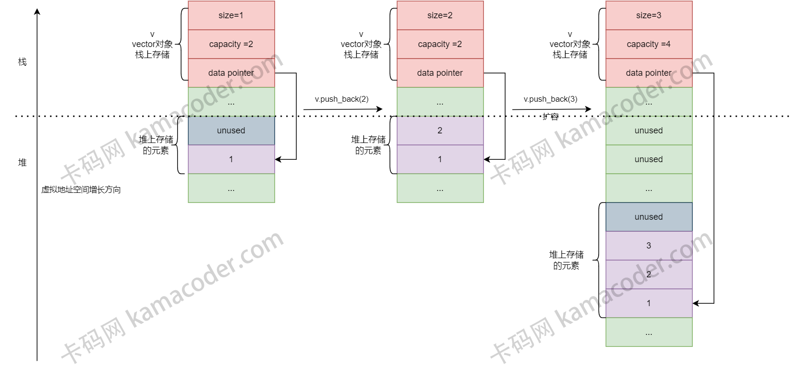

# Vector

`std::vector` 是一个动态数组，它在内存中以连续的块存储元素。与静态数组相比，`std::vector` 允许在运行时动态调整大小，而无需手动管理内存。

# 内存管理

`std::vector` 维护了两个重要的状态信息：容量（capacity）和大小（size）。

- 容量表示当前 vector 分配的内存空间大小
- 大小表示 vector **当前包含**的元素数量。
- 当向 vector 中添加元素时，如果元素数量超过了容量，就需要进行内存重新分配。

## 内存分配和释放

当容量不足以容纳新元素时，`std::vector` 会分配一块新的内存空间，将原有元素复制到新的内存中，然后释放原内存。这个过程确保了元素的连续存储。

## 动态扩容策略

为了提高性能，`std::vector` 采用了一种称为“指数增长（`exponential growth`）”的策略进行动态扩容。

- 当需要进行扩容时，`std::vector` 通常会将容量翻倍，以避免频繁的内存分配操作，从而减少系统开销。

这种指数增长策略确保了平均情况下的插入操作具有**常数时间复杂度**，而不是线性时间复杂度。

## 随机访问和迭代器

`std::vector` 提供了高效的随机访问能力，即通过索引直接访问元素。

- 因为元素在内存中是连续存储的，通过简单的指针运算即可实现 O(1) 时间复杂度的访问。

# 工作原理

`C++`中`vector`的数组内存通常是在堆上分配的。

- 当创建一个`vector`对象时，对象本身（即`vector`的控制结构，包括指向数据的指针、大小和容量等）通常存储在栈上（如果是局部变量）或其他存储区（如全局/静态存储区）
- 但实际的元素数据是在堆上分配的。

这种设计允许`vector`在运行时动态增长和收缩，因为堆是用于动态内存分配的区域，没有固定的大小限制（除了可用内存的物理限制）。当调用`vector`的`push_back`等方法时，`vector`可能会重新分配其底层的动态数组以适应新元素。这通常涉及申请新的更大的内存块，复制现有元素到新内存，添加新元素，然后释放旧的内存块。在`C++`官方实现的`vector`中，这种动态内存管理通常是通过分配器来完成的，`vector`使用一个默认的分配器`std::allocator`，它封装了动态内存分配函数，如`new`和`delete`。开发者也可以为`vector`提供自定义的分配器，以适应特定的内存分配策略。

1. 虚线以上的内存为**栈内存**，虚线以下的内存为**堆内存**
2. 红色区域为`vector`对象控制结构存储的位置
3. **紫色区域**和**灰色区域**为存储元素的数组的位置, 其中**紫色区域**表示已经使用, **灰色区域**表示未使用

# 实现

## 私有成员

1. 指向动态数组的指针
2. 容量
3. 当前大小（数组中元素的个数）
